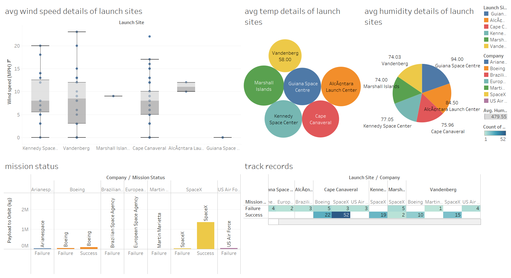

 
  
  &#xa0;

<h1 align="center">Space Mission Dashboard in Tableau</h1>

<!-- 

  

  

  

  

   

  

  

 -->

  <a href="#dart-about">About</a> &#xa0; | &#xa0; 
  <a href="#sparkles-features">Features</a> &#xa0; | &#xa0;
  <a href="#rocket-technologies">Technologies</a> &#xa0; | &#xa0;
  <a href="https://github.com/anshulg954" target="_blank">Author</a>

 

## :dart: About ##

Tableau is a powerful Data Visualization software, and much of its popularity is due to its interactive visualizations & user-friendly interface.
This tableau workbook gives an insight into space mission data, covering the data analytics as discussed in next section.

## :sparkles: The dashboard answers the following- ##
:heavy_check_mark: Average temperature details of launch sites;\
:heavy_check_mark: Average wind speed details of launch sites;\
:heavy_check_mark: Average humidity details of launch sites;\
:heavy_check_mark: Launch Vehicle Details;\
:heavy_check_mark: Mission Status;\
:heavy_check_mark: Track records of companies;\

## :rocket: Technologies ##

The following tool was used in this project:

- [Tableau](https://www.tableau.com/)

Made with :heart: by <a href="https://github.com/muskaan712" target="_blank">Muskaan Chopra</a>

&#xa0;

<a href="#top">Back to top</a>
